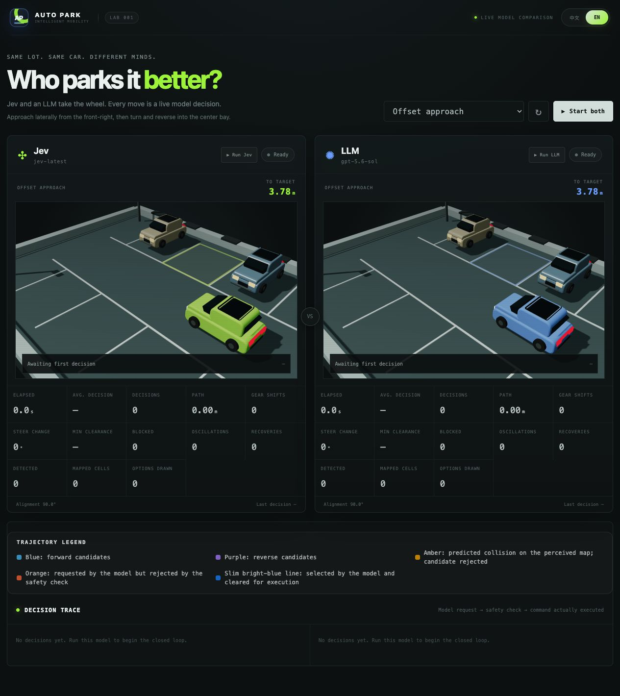
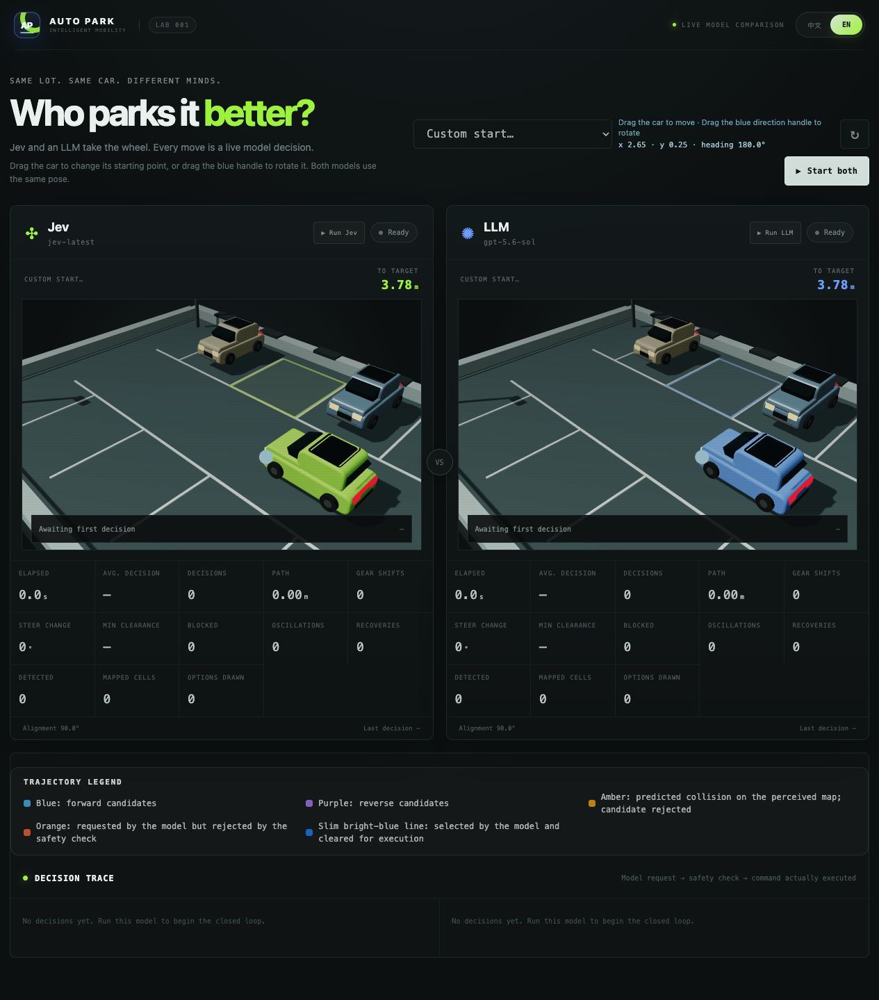

# Parking Lab · Jev vs LLM

[中文](README.md) | **English**

A Three.js 3D parking demo comparing Jev's structured choices with a general-purpose LLM's natural-language decisions under shared simulation rules.

Both engines use the same candidate generation, vehicle motion, safety checks and completion criteria. The current loop uses **one control per decision**: the model selects a gear, steering angle, target speed and duration, then continues deciding after execution.



*Actual interface: the offset approach scenario before starting a run.*

## Quick start

Requirements: Node.js 20+, npm, a WebGL-capable browser, Jev access and an LLM endpoint compatible with OpenAI Chat Completions.

```bash
git clone https://github.com/leeyang1990/jev-auto-part.git
cd jev-auto-part
npm ci
cp .env.example .env
```

Set your own configuration in `.env`:

```dotenv
LLM_BASE_URL=http://127.0.0.1:4000/v1
LLM_API_KEY=replace-me
LLM_MODEL=gpt-5.6-sol
JEV_BASE_URL=https://api.typesafe.ai/v1
JEV_API_KEY=replace-me
JEV_MODEL=jev-latest
PORT=4173
```

`127.0.0.1:4000` is an example local LLM gateway; this project does not start it. Replace the URL, key and model name when using another provider. Both model APIs are called by the Node.js server.

```bash
npm start
```

Open [http://127.0.0.1:4173](http://127.0.0.1:4173). Restart the server after changing `.env` or server code. The default listener is local-only. Store real credentials in `.env`; the repository contains placeholders and ignores `.env`, its configuration variants and log files.

## Using the demo

- Select a scenario and click **Start both**, or run and stop each engine separately.
- Six presets cover offset approach, tight angled approach, straight reverse entry, left-side approach, forward entry and wide-angle recovery.
- Select **Custom start**, drag the car to move it and drag the blue direction handle to rotate it. Both engines receive the same starting pose.
- Switch between Chinese and English at the top. Raw model explanations may remain in English.
- Inspect elapsed time, average decision latency, decision count, distance, gear changes, minimum clearance, safety refusals and oscillations.



*Custom scenario editor. Both engines use the same starting position and heading.*

Prediction lines use blue for forward, purple for reverse, amber for predicted collisions, orange for rejected model choices and bright blue for the approved selection. Some exploratory paths remain visible without being offered to the model.

For example, `R-10@0.42:0.60s` means reverse with −10° steering at a target speed of 0.42 m/s for 0.60 seconds. `F` means forward and `P` means hold position.

## Decision loop and comparison scope

```text
Simulated sensors → Perception map and tracking → Shared control candidates and rollouts
                                                           ↓
                                           Jev typed choice / LLM semantic choice
                                                           ↓
                                          Safety check → Execute → Next decision
```

| Component | Shared rules or differences |
| --- | --- |
| Model input | Jev receives a structured candidate table and typed-choice questions; the LLM receives a prose situation briefing and options |
| Controls | Identical states use the same generation, admission and measurement logic; models choose discrete candidates rather than arbitrary continuous controls |
| Perception | Simulated range sensing, occupancy mapping, tracking and prediction; no camera-image input or end-to-end visual driving |
| Motion | Kinematic bicycle-model rollouts and execution, rather than a full rigid-body or tire-dynamics simulation |
| History and recovery | Recent actions, poses and progress are retained; shared policy temporarily excludes known repeated states, leaving the model to choose remaining actions |
| Navigation | Presets contain authored navigation corridors and stages for guidance and progress measurement, not complete parking control sequences for automatic execution |
| Safety | Unsafe choices are refused, never replaced with another moving action; simulation ground truth also detects perception misses and triggers an emergency hold |

Candidate construction includes engineering heuristics and safety constraints. This experiment compares **two model decision interfaces within a shared control framework**. No local controller selects subsequent movement or takes over to finish parking. An already parked car, or one with no feasible moving option, may hold locally. The active execution pipeline has no three-segment planning or trajectory-smoothing optimization.

The engines' states diverge as they make different choices, so later candidate tables need not match. Results also depend on model versions, input representation, provider latency and network conditions. A single elapsed-time result is not a general capability ranking.

## Parking completion

The shared definition is in [public/parking-goal.js](public/parking-goal.js):

- The simulated vehicle rectangle is entirely inside the target bay, with at least **5 cm** clearance from the inner edge of every painted line.
- Heading is within **12°** of the required direction.
- At a qualifying control endpoint, the vehicle stops without further adjustments for exact centering.

The browser, server, model candidate measurements and comparison tests use the same predicate. The default vehicle is 1.75 × 0.82 m; the bay is 2.20 × 2.04 m.

## Validation

Checks that do not call external models:

```bash
npm run check
node scripts/parking-goal-check.mjs
node scripts/shared-trajectory-check.mjs
node scripts/fairness-contract-check.mjs
node scripts/safety-admission-check.mjs
node scripts/history-loop-check.mjs
node scripts/recovery-loop-integration-check.mjs
node scripts/perception-check.mjs
```

`shared-trajectory-check.mjs` retains its earlier filename but now checks single-step controls. Live model tests require the running server and configured credentials, and make real API calls:

```bash
# Run each engine on the same scenario
TEST_MAX_MOVES=20 node scripts/e2e-decision-loop.mjs jev reverse-entry
TEST_MAX_MOVES=20 node scripts/e2e-decision-loop.mjs llm reverse-entry

# Print a comparison; omit the scenario argument to run all scenarios
npm run test:e2e -- reverse-entry
```

Test scripts default to 30 decisions, configurable through `TEST_MAX_MOVES`; this cap does not apply to browser runs. Command-line loop tests inspect returned controls and paths. They do not validate browser animation or wait for its duration. The scripted custom scenario uses the default start, not the pose edited in the browser.

## Code structure

| File / directory | Responsibility |
| --- | --- |
| `server.js` | HTTP service and decision orchestration |
| `models.js` / `briefing.js` | Model API adapters and LLM prose briefing |
| `parking/` | Control candidates, kinematics, navigation, perception sessions and recovery policy |
| `perception.js` | Simulated sensors, map, tracking and collision checks |
| `scenarios.js` | Scenario starts, targets and descriptions |
| `public/` | Three.js rendering, UI, localization and shared parking criteria |
| `scripts/` | Rule checks and live model comparisons |

See [ARCHITECTURE.md](ARCHITECTURE.md) for details. Complex scenarios may still oscillate, fail to progress or encounter API errors; successful parking is not guaranteed on every run. When a model response takes longer than the current action, the vehicle waits for the next result, which affects the interactive experience.
