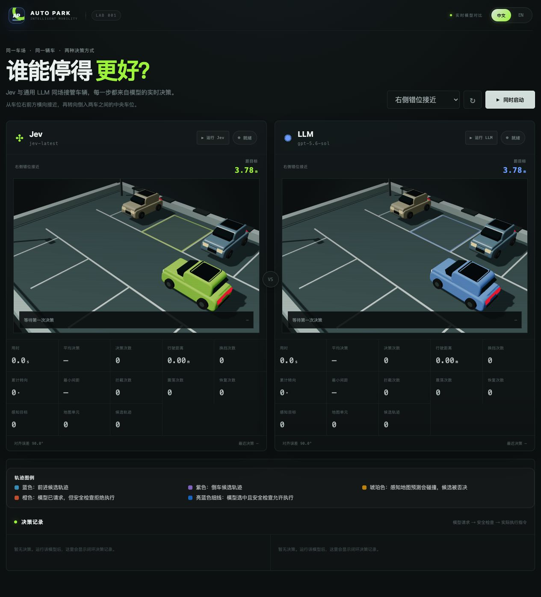
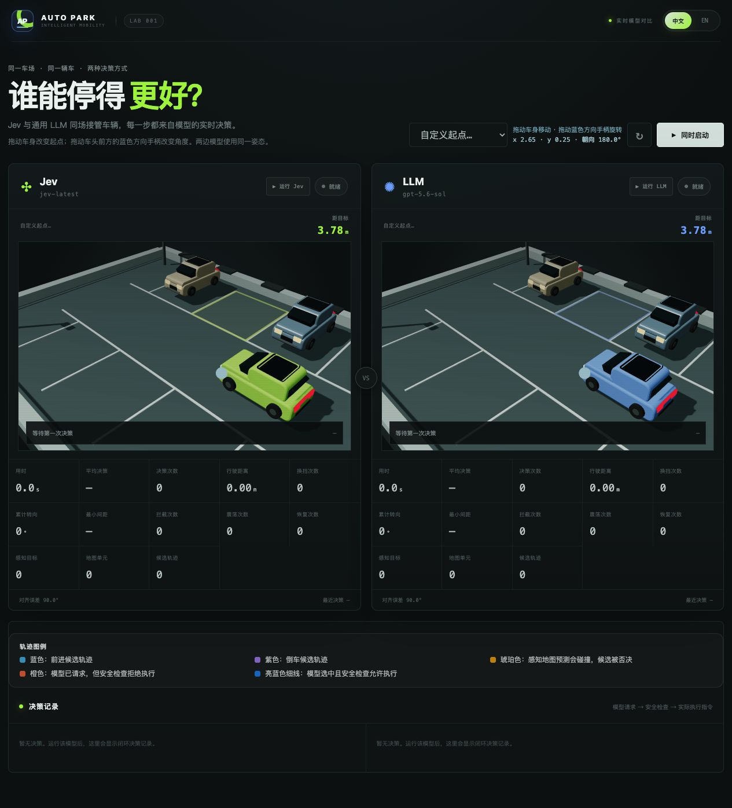

# Parking Lab · Jev vs LLM

**中文** | [English](README.en.md)

一个用 Three.js 展示的 3D 停车决策对比 Demo：让 Jev 通过结构化选项决策，让通用 LLM 通过自然语言描述决策，观察两者在同一仿真规则下的表现。

两边使用相同的候选生成、车辆运动、安全检查和完成判定。当前采用**单步闭环**：模型每次选择一个包含挡位、转角、速度与持续时间的控制动作，执行后继续决策。



*实际界面截图：右侧错位接近场景，尚未开始运行。*

## 快速开始

需要 Node.js 20+、npm、支持 WebGL 的浏览器，以及 Jev 和兼容 OpenAI Chat Completions 的 LLM 接口。

```bash
git clone https://github.com/leeyang1990/jev-auto-part.git
cd jev-auto-part
npm ci
cp .env.example .env
```

在 `.env` 中填写自己的配置：

```dotenv
LLM_BASE_URL=http://127.0.0.1:4000/v1
LLM_API_KEY=replace-me
LLM_MODEL=gpt-5.6-sol
JEV_BASE_URL=https://api.typesafe.ai/v1
JEV_API_KEY=replace-me
JEV_MODEL=jev-latest
PORT=4173
```

`127.0.0.1:4000` 是本地 LLM 网关示例，本项目不会启动它。使用其他服务时，替换地址、密钥和模型名。两种模型的请求都由 Node.js 服务端发起。

```bash
npm start
```

打开 [http://127.0.0.1:4173](http://127.0.0.1:4173)。修改 `.env` 或服务端代码后需要重启服务；默认只监听本机。真实密钥放在 `.env` 中，仓库只提供占位符；`.env`、配置变体和日志已被 Git 忽略。

## 怎么使用

- 在右侧选择场景，点击「同时启动」，或分别运行、停止 Jev / LLM。
- 支持六个预设：右侧错位接近、狭角调整、直线倒车、左侧接近、前进入库、大角度恢复。
- 选择「自定义起点」，拖动车身修改位置，拖动蓝色方向手柄修改朝向；两边使用同一起点。
- 顶部支持中英文切换；决策记录中的模型原始解释可能仍为英文。
- 查看用时、平均决策耗时、决策次数、行驶距离、换挡、最小间距、拦截及震荡记录。



*自定义场景编辑界面，两边同步使用相同的起点与朝向。*

预测线中，蓝色表示前进，紫色表示倒车，琥珀色表示预测碰撞，橙色表示被拦截的模型选择，亮蓝色表示获准执行的选择。部分展示用探索轨迹可能不会进入模型可选列表。

例如 `R-10@0.42:0.60s` 表示倒车、转角 −10°、目标速度 0.42 m/s，持续 0.60 秒；`F` 表示前进，`P` 表示原地保持。

## 决策流程与对比边界

```text
模拟传感器 → 感知地图与目标跟踪 → 共享控制候选与运动预测
                                      ↓
                          Jev 结构化选择 / LLM 语义选择
                                      ↓
                        安全检查 → 执行所选动作 → 下一轮
```

| 项目 | 共同规则或差异 |
| --- | --- |
| 模型输入 | Jev 使用结构化候选表与 typed-choice 问题；LLM 使用自然语言情境与选项说明 |
| 候选动作 | 相同状态下共用同一套生成、筛选和测量逻辑；模型从离散候选中选择，并非任意输出连续控制量 |
| 感知 | 使用模拟测距、占据地图、目标跟踪与预测；当前不是摄像头图像输入或视觉端到端驾驶 |
| 运动 | 使用运动学自行车模型预测并执行控制路径；不是完整刚体、轮胎动力学仿真 |
| 历史与恢复 | 记录近期动作、位置和进展；共享策略暂时排除已知重复状态，模型选择剩余动作 |
| 导航 | 预设场景包含人工定义的导航走廊与阶段，用于引导和衡量进度；不提供自动执行的完整停车动作序列 |
| 安全 | 不安全选择只会被拒绝，不会替换为另一个移动动作；仿真真值还用于检测感知遗漏并触发紧急停车 |

候选构建包含工程启发式与安全约束，所以这里比较的是**共享控制框架下的两种模型决策接口**。没有本地控制器替模型选择后续移动或自动收尾；已经停好或没有可行移动时可以本地保持静止。当前执行链路没有三段多步规划或轨迹平滑优化。

两边的实际状态会随各自选择而分化，因此后续候选不必完全相同。比较结果同时受模型版本、输入表示、服务延迟和网络影响，不应把单次用时当作通用能力排名。

## 什么算停好

共享判定见 [public/parking-goal.js](public/parking-goal.js)：

- 仿真车身矩形完全进入目标车位，距每条车位线的内侧至少 **5 厘米**。
- 朝向与任务要求的朝向相差不超过 **12°**。
- 在满足条件的动作终点停止，不再为了精确居中反复调整。

前端、服务端、模型候选测量和对比测试使用同一判定。默认车身为 1.75 × 0.82 米，车位为 2.20 × 2.04 米。

## 验证

不调用外部模型的检查：

```bash
npm run check
node scripts/parking-goal-check.mjs
node scripts/shared-trajectory-check.mjs
node scripts/fairness-contract-check.mjs
node scripts/safety-admission-check.mjs
node scripts/history-loop-check.mjs
node scripts/recovery-loop-integration-check.mjs
node scripts/perception-check.mjs
```

`shared-trajectory-check.mjs` 沿用旧文件名，当前检查的是单步控制。真实模型测试需要先启动服务、填写密钥，会产生 API 请求：

```bash
# 同一个场景分别测试两种模型
TEST_MAX_MOVES=20 node scripts/e2e-decision-loop.mjs jev reverse-entry
TEST_MAX_MOVES=20 node scripts/e2e-decision-loop.mjs llm reverse-entry

# 输出双模型对比；省略场景参数则遍历全部场景
npm run test:e2e -- reverse-entry
```

测试脚本默认上限为 30 次决策，可用 `TEST_MAX_MOVES` 调整；这个上限不限制浏览器运行。命令行闭环测试检查返回的控制与路径，不验证浏览器动画，也不按动画时长等待。自定义场景在脚本中使用默认起点，不读取浏览器拖拽状态。

## 代码结构

| 文件 / 目录 | 职责 |
| --- | --- |
| `server.js` | HTTP 服务和单次决策编排 |
| `models.js` / `briefing.js` | 模型 API 适配与 LLM 语义描述 |
| `parking/` | 候选生成、运动学、导航、感知会话和恢复策略 |
| `perception.js` | 模拟传感器、地图、跟踪及碰撞检查 |
| `scenarios.js` | 场景起点、目标和文案 |
| `public/` | Three.js 场景、界面、语言切换和共享停车判定 |
| `scripts/` | 规则检查与真实模型对比脚本 |

详细设计见 [ARCHITECTURE.md](ARCHITECTURE.md)。复杂场景仍可能出现震荡、无进展或接口错误；本项目是模型决策实验，不保证每次都能完成停车。模型响应慢于当前动作时，车辆会等待下一次结果，这也会体现在实际体验中。
